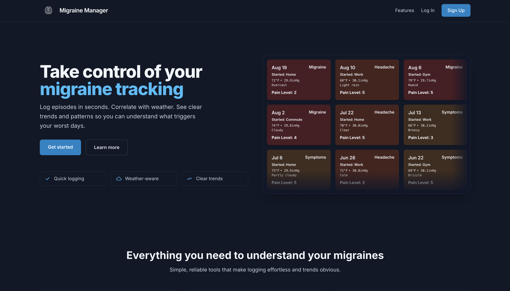

# 🧠 Migraine Manager

Migraine Manager is a full stack web application designed to help users track and manage their migraine episodes. It provides an intuitive interface for logging migraine events, including details such as pain level, duration, potential triggers, and more.

[migraine-manager.com](https://www.migraine-manager.com/)

---

## 🛠️ How It's Made:

**Tech used:** HTML, EJS, JavaScript, Tailwind CSS, Node.js, Express.js, MongoDB

Migraine Manager is built on a robust full-stack architecture:

- The backend is powered by Node.js and Express.js, providing a fast and scalable server-side foundation.
- MongoDB is used as the database, offering flexibility for storing complex migraine event data.
- EJS (Embedded JavaScript) templating engine is employed for server-side rendering, allowing for dynamic content generation.
- The frontend is styled using Tailwind CSS, ensuring a responsive and modern user interface.
- User authentication is implemented using Passport.js, providing secure access to personal data.
- RESTful API principles are followed for clear and predictable server-client communication.

MM features a clean, intuitive UI with color-coded events for quick visual recognition. Users can easily add, edit, and delete migraine events. Forms are designed for quick data entry, which is crucial to people who may be sensitive to light during an attack.

The dashboard provides an overview of recent activity as well as the ability to log an episode in one click.

## 🌟 Future Optimizations & Features:

While the current version of Migraine Manager is functional and user-friendly, there are several optimizations planned for future iterations:

- ✅ Data visualization features to help users better understand their migraine patterns and trends over time
- ✅ Retrieval of weather data using an API to keep track of weather conditions associated with migraine attacks for 
- 🔲 Google OAuth
- 🔲 CSV data exporting
- 🔲 A reminder system for logging migraines and preventative medication
- 🔲 A calendar view to help users see patterns in episodes and keep track of medication

## 📝 Lessons Learned:

- Simplifying data entry and providing clear, actionable insights is crucial for user engagement. 
- The value of modular code architecture in facilitating easier updates and maintenance of the application.
- The power of CSS frameworks like Tailwind in rapidly developing a consistent and responsive UI.

Building Migraine Manager reinforced the idea that technology can have a meaningful impact on people's daily lives, especially in managing health conditions. It has been rewarding to create a tool that can improve the quality of life for those dealing with migraines.

---

## Installation:

`npm install`

### Dependencies:
- bcrypt: password hashing
- chart.js: data visualization
- connect-mongo: MongoDB session store
- dotenv: environment variable management
- ejs: templating
- express: server framework
- express-ejs-layouts: layout support in EJS
- express-flash: flash messages
- express-session: session handling
- method-override: HTTP verb support
- mongodb: MongoDB driver
- mongoose: MongoDB object modeling
- morgan: HTTP request logging
- nodemon: auto-restarting server
- node-fetch: HTTP requests
- passport: authentication
- passport-local: local authentication strategy
- validator: data validation

---

## Things to add

- Create a `.env` file in config folder and add the following as `key = value`
  - PORT = 3000
  - DB_STRING = `your database URI`
  - WEATHER_API_BASE_URL = https://api.weatherbit.io/v2.0/current?
  - WEATHER_API_KEY = `your weatherbit API key`

---

## 🚀 Run

`npm start`