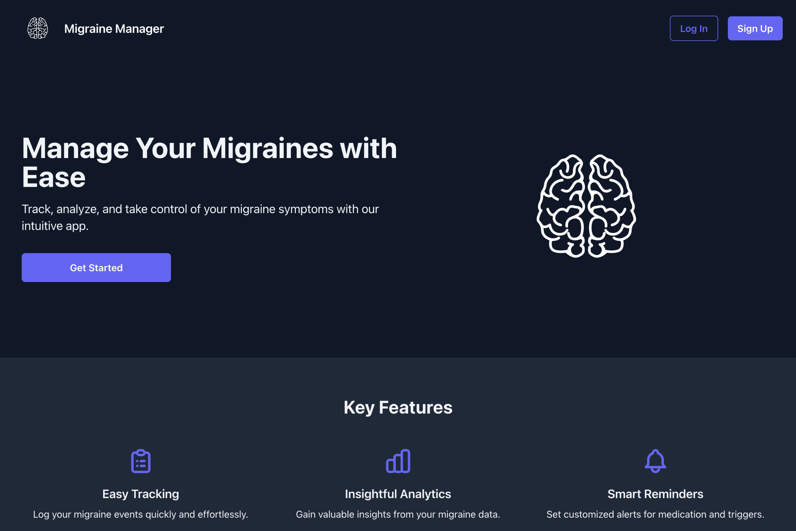

# Migraine Manager

Migraine Manager is a web application designed to help users track and manage their migraine episodes. It provides an intuitive interface for logging migraine events, including details such as pain level, duration, and potential triggers. With its user-friendly design and comprehensive tracking features, Migraine Manager empowers users to better understand and manage their migraine patterns.

**Link to project:** COMING SOON

---

## How It's Made:

**Tech used:** HTML, CSS, JavaScript, Node.js, Express.js, MongoDB, EJS, Tailwind CSS

Migraine Manager is built on a robust full-stack architecture:

- The backend is powered by Node.js and Express.js, providing a fast and scalable server-side foundation.
- MongoDB is used as the database, offering flexibility for storing complex migraine event data.
- EJS (Embedded JavaScript) templating engine is employed for server-side rendering, allowing for dynamic content generation.
- The frontend is styled using Tailwind CSS, ensuring a responsive and modern user interface.
- User authentication is implemented using Passport.js, providing secure access to personal migraine data.
- RESTful API principles are followed for clear and predictable server-client communication.

The application features a clean, intuitive UI with color-coded migraine events for quick visual recognition. Users can easily add, edit, and delete migraine events, with forms designed for quick data entry. 

The dashboard provides an overview of recent migraine activity, helping users identify patterns and potential triggers.

## Optimizations

While the current version of Migraine Manager is functional and user-friendly, there are several optimizations planned for future iterations:

- [ ] Implement data visualization features to help users better understand their migraine patterns and trends over time.
- [ ] Optimize database queries for faster data retrieval, especially for users with extensive migraine history.
- [ ] Implement caching strategies to reduce server load and improve application responsiveness.

## Lessons Learned:

Developing Migraine Manager has been a journey of continuous learning and problem-solving. Some key takeaways include:

- The importance of user-centric design in healthcare applications. Simplifying data entry and providing clear, actionable insights is crucial for user engagement.
- Handling date and time data across different timezones presented unique challenges, emphasizing the importance of consistent data handling and display.
- Implementing secure user authentication and data privacy measures is paramount when dealing with personal health information.
- The value of modular code architecture in facilitating easier updates and maintenance of the application.
- The power of CSS frameworks like Tailwind in rapidly developing a consistent and responsive UI.

Building Migraine Manager reinforced the idea that technology can have a meaningful impact on people's daily lives, especially in managing health conditions. It has been rewarding to create a tool that can potentially improve the quality of life for migraine sufferers.

---

## Install

`npm install`

### Dependencies:
- bcrypt: password hashing
- connect-mongo: MongoDB session store
- dotenv: environment variable management
- ejs: templating
- express: server framework
- express-ejs-layouts: layout support in EJS
- express-flash: flash messages
- express-session: session handling
- method-override: HTTP verb support
- mongodb: MongoDB driver
- mongoose: MongoDB object modeling
- morgan: HTTP request logging
- nodemon: auto-restarting server
- passport: authentication
- passport-local: local authentication strategy
- validator: data validation

---

## Things to add

- Create a `.env` file in config folder and add the following as `key = value`
  - PORT = 2121 (can be any port example: 3000)
  - DB_STRING = `your database URI`

---

## Run

`npm start`

If changing styling: run `npm run build:css` in a separate terminal